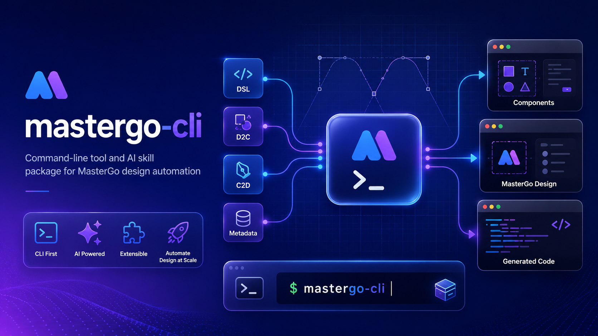

# @cloudglab/mastergo-cli



[中文文档](README.zh-CN.md)

Connect MasterGo design DSL, D2C/C2D, metadata, component docs, and component workflows to the command line for CI, scripts, and AI Skills.

## Installation

### One-command CLI + Skill install

```bash
npx -y @cloudglab/mastergo-cli@latest install
```

This installs or updates the global CLI and installs the bundled `mastergo-cli` skill.

By default, the skill is installed from the GitHub repository. If your environment can access npm but cannot clone remote `.git` repositories, use npm static package mode:

```bash
npx -y @cloudglab/mastergo-cli@latest install --skill-source npm
```

If you already downloaded and extracted the npm package, install from the local directory:

```bash
mastergo install --skill-local-path ./package
```

Update later with:

```bash
mastergo update
```

### Temporary use in CI / scripts

```bash
npx -y @cloudglab/mastergo-cli@latest help
npx -y @cloudglab/mastergo-cli@latest dsl "https://mastergo.com/goto/LhGgBAK"
npx -y @cloudglab/mastergo-cli@latest dsl "https://mastergo.com/goto/LhGgBAK" --simplify
```

### Global install

```bash
npm i -g @cloudglab/mastergo-cli@latest
mastergo --version
mastergo version
mastergo help
```

### Skill install

Default GitHub repository mode:

```bash
npx -y skills add -g cloudglab/mastergo-cli
```

If you can only access npm:

```bash
npm pack @cloudglab/mastergo-cli@latest
tar -xzf cloudglab-mastergo-cli-*.tgz
npx -y skills add -g ./package
```

Inside Skill / Agent workflows, prefer local CLI commands:

```bash
mastergo dsl "https://mastergo.com/goto/LhGgBAK"
```

Fallback to `npx` when the CLI is not installed:

```bash
npx -y @cloudglab/mastergo-cli@latest dsl "https://mastergo.com/goto/LhGgBAK"
```

## Environment variables

```bash
export MASTERGO_TOKEN="mg_your_token_here"
export API_BASE_URL="https://mastergo.com"

# Optional proxy
export HTTPS_PROXY="http://127.0.0.1:7890"

# Legacy Python helper compatibility
export MASTERGO_ENDPOINT="https://mastergo.com"
```

Do not print token values in logs or terminal output.

## MCP configuration examples

### OpenCode local MCP

```json
{
  "mcp": {
    "mastergo-magic-mcp": {
      "type": "local",
      "command": [
        "npx",
        "-y",
        "@mastergo/magic-mcp",
        "--token=<YOUR_TOKEN>",
        "--url=https://mastergo.com"
      ],
      "enabled": true,
      "environment": {
        "NPM_CONFIG_REGISTRY": "https://registry.npmjs.org/",
        "HTTPS_PROXY": "http://127.0.0.1:7890"
      }
    }
  }
}
```

### Cursor SSE MCP

```json
{
  "mcpServers": {
    "mastergo-magic-mcp": {
      "url": "https://mastergo.com/mcp/xf/sse",
      "headers": {
        "x-mg-useraccesstoken": "<YOUR_TOKEN>"
      },
      "env": {
        "HTTPS_PROXY": "http://127.0.0.1:7890"
      }
    }
  }
}
```

## Scenario prompts

These prompts can be handed to an AI Skill / Agent and mapped to `mastergo-cli` commands.

### Official upstream examples

- Extract SVG and preview in HTML: `https://{domain}/file/{fileId}?layer_id={layerId}`
- Restore design: `https://{domain}/file/{fileId}?layer_id={layerId}`
- Restore design: `https://{domain}/goto/{shortLink}`
- Restore design, save as HTML file: `https://{domain}/file/{fileId}?layer_id={layerId}`
- Restore design, save as HTML file: `https://{domain}/goto/{shortLink}`

### Design DSL and structure

- Parse this MasterGo design URL.
- Get the DSL for this design layer.
- Show me the page structure as a tree.
- Simplify this DSL to reduce token consumption.
- Split this large design into sections before implementation.
- Fetch section SVG previews and exact long text.
- Extract all text from this design.
- Find component documentation links in this DSL.
- Analyze navigations between pages.

### D2C: design to code

- Fetch D2C code for this `mastergo://getd2c/...` URL.
- Save generated Vue/HTML and assets locally.
- Get D2C output and put resources under `./mastergo-output`.
- Try D2C from a file URL and layer path.
- Explain why this D2C contentId returns 10009.

### C2D: code to design

- Sync this local HTML file back to MasterGo.
- Upload `index.html` to this MasterGo file URL.
- Push generated code to a specific `fileId` and `layer_id`.
- Use only the URL `layer_id` as the target layer.

### Site metadata and component workflow

- Get website metadata for this design page.
- Generate component development workflow files.
- Create `.mastergo/component-workflow.md` for this component.
- Fetch linked component documentation before generating code.
- Save component JSON and SVG assets under the current project.

## Common commands

```bash
# DSL and readable summaries
mastergo dsl "https://mastergo.com/goto/LhGgBAK"
mastergo dsl "https://mastergo.com/goto/LhGgBAK" --source-layer-id 1:24
mastergo dsl "https://mastergo.com/goto/LhGgBAK" --proxy http://127.0.0.1:7890
mastergo dsl "https://mastergo.com/goto/LhGgBAK" --simplify
mastergo analyze "https://mastergo.com/goto/LhGgBAK"
mastergo analyze "https://mastergo.com/goto/LhGgBAK" --format json

# Large-design section workflow
mastergo design-sections "https://mastergo.com/goto/LhGgBAK"
mastergo design-sections "https://mastergo.com/goto/LhGgBAK" --section-index 0
mastergo design-svgs "https://mastergo.com/goto/LhGgBAK"
mastergo design-texts "https://mastergo.com/goto/LhGgBAK"
mastergo extract-svg "https://mastergo.com/goto/LhGgBAK" --background-color '#ffffff'

# D2C code and assets
mastergo d2c --d2c-url "mastergo://getd2c/176452330285910-2-2845" --out-dir ./mastergo-output
mastergo d2c --content-id 176452330285910-2-2845 --document-id 176452330285910 --out-dir ./mastergo-output

# C2D sync
mastergo c2d --file ./index.html --short-link "https://mastergo.com/file/176452330285910?layer_id=1:23"
mastergo c2d --file ./index.html --file-id 176452330285910 --layer-id 1:23

# Metadata and components
mastergo meta --file-id 176452330285910 --layer-id 1:23
mastergo component-doc "https://example.com/button.mdx"
mastergo component-workflow --root "$PWD" --file-id 176452330285910 --layer-id 1:23
mastergo fetch-docs "https://example.com/button.mdx"
```

## Command coverage

| Command | Purpose |
|---------|---------|
| `mastergo dsl` | Retrieve wrapped output with `dsl`, `componentDocumentLinks`, and `rules` |
| `mastergo design-sections` | Retrieve section overview or one section with `--section-index` for large designs |
| `mastergo design-svgs` | Retrieve cached SVG HTML grouped by section/layer for visual fidelity |
| `mastergo design-texts` | Retrieve exact text payloads for long-copy fidelity |
| `mastergo extract-svg` | Retrieve raw SVG snippets for a specific design layer |
| `mastergo analyze` | Print human-readable DSL summaries with legacy zero-dependency Python scripts |
| `mastergo d2c` | Retrieve D2C data and save Vue/HTML code, SVG, and image resources locally |
| `mastergo c2d` | Read local HTML and sync it back to MasterGo; short links only use `layer_id` |
| `mastergo meta` | Retrieve site/page metadata and meta generation rules |
| `mastergo component-doc` | Fetch linked component documentation |
| `mastergo component-workflow` | Create `.mastergo/component-workflow.md`, component JSON, and SVG assets |

## DSL simplification

Use `--simplify` when a design contains many vector/icon paths and the raw DSL is too large for an AI context window:

```bash
mastergo dsl "https://mastergo.com/goto/LhGgBAK" --simplify
```

The option is disabled by default. When enabled, icon-like `PATH` / `VECTOR` / SVG nodes and nodes named like icons are converted to `ICON_PLACEHOLDER`, while layout and key style fields are preserved for implementation context. The output includes `_simplified` and `_simplificationStats` fields.

## Large-design sections

For large pages, prefer the section workflow before falling back to raw DSL:

```bash
mastergo design-sections "https://mastergo.com/goto/LhGgBAK"
mastergo design-sections "https://mastergo.com/goto/LhGgBAK" --section-index 0
mastergo design-svgs "https://mastergo.com/goto/LhGgBAK"
mastergo design-texts "https://mastergo.com/goto/LhGgBAK"
```

Call `design-sections` once without `--section-index` to get the overview, then fetch every section index before implementation. Use `design-svgs` for cached SVG HTML and `design-texts` to preserve exact long text. `mastergo dsl` remains available as a fallback when the section APIs are unavailable.

## D2C notes

`contentId` accepts two forms:

1. A D2C task run id, for example `mastergo://getd2c/<id>`.
2. A derived file/layer path, for example `<fileId>-<layerId>[/<expandedNodeId>...]`.

If a direct file URL derivation returns `10009`, first call `mastergo dsl <file-link>` to inspect expanded node paths, then retry with the full layer path. `/` in ids is sanitized to `_` for output filenames.

Generated D2C resources follow the API `resourcePath` field. The code file is saved as `.vue` when `frameType` or code content indicates Vue; otherwise it is saved as `.html`. When `resourcePath` is absent, images are written to `asset/images` and SVGs to `asset/icons` under `--out-dir`.

## Repository layout

```text
bin/mastergo.js                         CLI entry point
skills/mastergo-cli/SKILL.md            Agent skill entry point
skills/mastergo-cli/scripts/            Legacy Python helper scripts
skills/mastergo-cli/references/         DSL, D2C, meta, and workflow references
assets/readme/mastergo-cli-hero.png     README hero image
```

## More commands

```bash
mastergo help
mastergo version
mastergo install --skill-source npm
mastergo update --skill-source npm
```

## License

MIT
